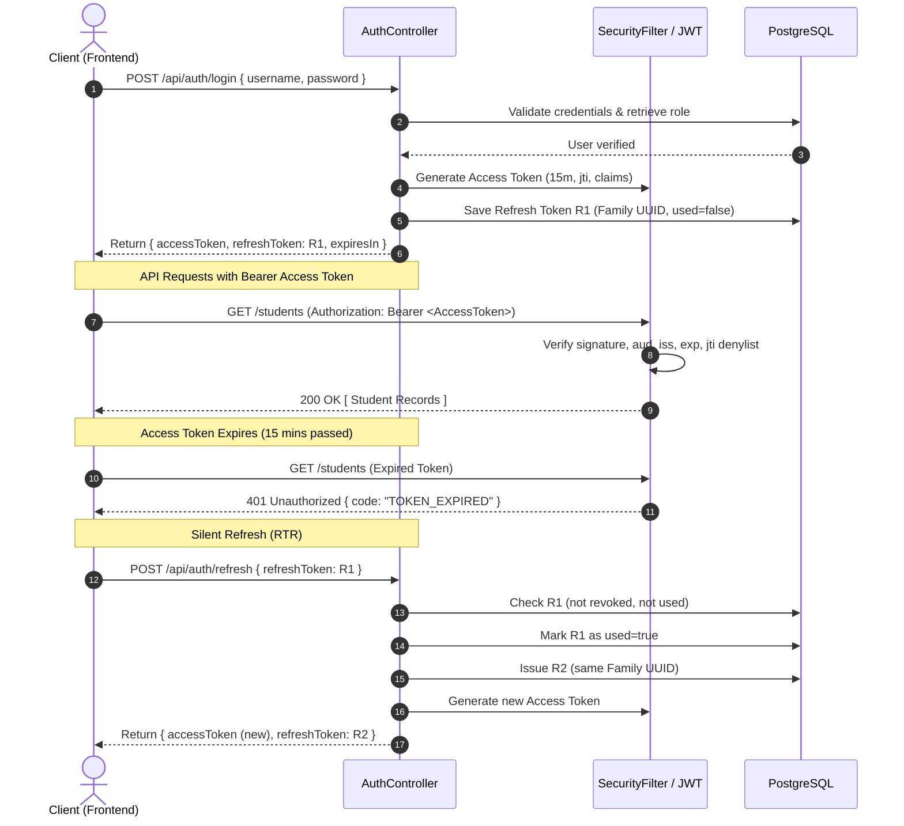

# 🛡️ Enterprise Spring Boot JWT Security Architecture

> A production-ready, enterprise-grade authentication and authorization service built on **Spring Boot 3.3.2**, **Spring Security 6**, and **Java 21**. Implements advanced dual-token architecture (Access & Refresh Tokens), **Refresh Token Rotation (RTR)** with **Family Reuse Detection**, token denylisting via `jti`, strict production claims, clock skew tolerance, and Role/Scope-Based Access Control (RBAC/SBAC).

---

## 🌐 Live Deployment
* **Live Backend URL:** [https://jwt-backend-obtt.onrender.com/](https://jwt-backend-obtt.onrender.com/)  
> ⚠️ **Note:** Deployed on Render (free tier). If the service has been idle, spin-up may take ~45–60 seconds on the first request.

---

## 📑 Table of Contents
1. [Architecture Overview](#-architecture-overview)
2. [Core Production Concepts & Design Patterns](#-core-production-concepts--design-patterns)
   - [Access Token vs Refresh Token](#1-access-token-vs-refresh-token)
   - [Production JWT Claims Architecture](#2-production-jwt-claims-architecture)
   - [Refresh Token Rotation (RTR) & Reuse Detection](#3-refresh-token-rotation-rtr--reuse-detection)
   - [Token Revocation & Denylisting via JTI](#4-token-revocation--denylisting-via-jti)
   - [Algorithm Security & JWKS / Asymmetric Signing](#5-algorithm-security--jwks--asymmetric-signing)
   - [Audience & Issuer Validation](#6-audience--issuer-validation)
   - [Clock Skew & Distributed Leeway](#7-clock-skew--distributed-leeway)
   - [Browser Storage: Cookies vs LocalStorage](#8-browser-storage-cookies-vs-localstorage)
   - [Stateless vs Stateful Auth (Redis / Hybrid)](#9-stateless-vs-stateful-auth)
   - [Roles vs Fine-Grained Scopes](#10-roles-vs-fine-grained-scopes)
   - [Microservices & Token Exchange](#11-microservices--token-exchange)
3. [JWT Failure Modes & Interview Guide](#-jwt-failure-modes--interview-guide)
4. [Sequence Diagrams](#-sequence-diagrams)
5. [API Specification & Endpoints](#-api-specification--endpoints)
6. [Configuration & Environment Variables](#-configuration--environment-variables)
7. [Running Locally & Deployment](#-running-locally--deployment)

---

## 🏗️ Architecture Overview

```
                          ┌───────────────────────────┐
                          │    Client (Web / Mobile)  │
                          └─────────────┬─────────────┘
                                        │
           1. POST /login               │ 2. Return Access Token (15 min)
              (Credentials)             │    + Refresh Token (7 days)
                                        ▼
                          ┌───────────────────────────┐
                          │   Spring Security Filter  │
                          │        (JwtFilter)        │
                          └─────────────┬─────────────┘
                                        │
             ┌──────────────────────────┼──────────────────────────┐
             ▼                          ▼                          ▼
┌─────────────────────────┐┌─────────────────────────┐┌─────────────────────────┐
│   JWT Claims Validator  ││   JTI Token Denylist    ││  Refresh Token Service  │
│  - iss, aud, exp, nbf   ││  - Memory/Redis cache   ││  - Rotation (RTR)       │
│  - Clock skew (60s)     ││  - Immediate logout     ││  - Reuse Detection      │
└─────────────────────────┘└─────────────────────────┘└─────────────────────────┘
             │                          │                          │
             └──────────────────────────┼──────────────────────────┘
                                        ▼
                          ┌───────────────────────────┐
                          │   PostgreSQL Persistence  │
                          │   - users, refresh_tokens │
                          └───────────────────────────┘
```

---

## 🧠 Core Production Concepts & Design Patterns

### 1. Access Token vs Refresh Token
* **Access Token**: Short-lived (**5–15 minutes**). Carries user identity, role, and fine-grained scopes. Statelessly verified on every API request.
* **Refresh Token**: Long-lived (**7–30 days**). Kept strictly confidential and persisted in the database with rotation metadata. Used solely to request a new access token without requiring the user to re-enter their credentials.

> ⚠️ **Production Rule:** Never use long-lived access tokens. If a 30-day access token is leaked, an attacker has a 30-day unrestricted replay window. Short access tokens bound the window of compromise.

---

### 2. Production JWT Claims Architecture
A well-structured production JWT contains standardized RFC 7519 claims:

| Claim | Name | Description | Example in This Project |
| :--- | :--- | :--- | :--- |
| `iss` | Issuer | Principal that issued the JWT | `https://auth.kvlogics.com` |
| `sub` | Subject | User identity / username | `keerthi` |
| `aud` | Audience | Intended recipient API service | `https://api.kvlogics.com` |
| `exp` | Expiration | Unix epoch timestamp when token expires | `1726145700` (+15 min) |
| `iat` | Issued At | Unix epoch timestamp of issuance | `1726144800` |
| `nbf` | Not Before | Unix epoch before which token is invalid | `1726144800` |
| `jti` | JWT ID | Unique cryptographically secure token ID | `a8b3f1e2-54c7-...` |
| `typ` | Type | Token type header/claim | `ACCESS` |
| `role` | Role | Coarse authorization role | `ADMIN` / `USER` |
| `scope`| Scopes | Fine-grained permissions (least privilege)| `students:read students:write` |

```json
{
  "iss": "https://auth.kvlogics.com",
  "aud": "https://api.kvlogics.com",
  "sub": "admin",
  "jti": "550e8400-e29b-41d4-a716-446655440000",
  "role": "ADMIN",
  "scope": "students:read students:write students:delete",
  "typ": "ACCESS",
  "iat": 1726144800,
  "nbf": 1726144800,
  "exp": 1726145700
}
```

---

### 3. Refresh Token Rotation (RTR) & Reuse Detection
Standard refresh token mechanisms can be vulnerable to token theft. If a refresh token is stolen, an attacker can silently refresh tokens indefinitely.

**Refresh Token Rotation solves this:**
1. Every time a refresh token $R_1$ is exchanged, $R_1$ is invalidated (`used = true`) and a brand new refresh token $R_2$ is issued within the same **Token Family**.
2. **Replay / Reuse Detection:** If an attacker attempts to use $R_1$ after it has already been consumed:
   - The server detects that $R_1$ was marked `used`.
   - **Compromise Alert:** The server immediately marks the **entire Token Family as revoked**.
   - All child tokens are invalidated, immediately terminating both the attacker's and the legitimate user's active sessions and forcing a re-login.

```
Legitimate Flow:
Login ───> R1 (Family F1)
Refresh ──> R1 consumed ───> Issues R2 (Family F1)
Refresh ──> R2 consumed ───> Issues R3 (Family F1)

Attack Scenario (Stolen R1):
Attacker submits R1 ──> System detects R1 is ALREADY USED!
                     ──> TRIGGER REUSE DETECTION
                     ──> Revoke entire Family F1 (R1, R2, R3)
                     ──> Force immediate re-authentication
```

---

### 4. Token Revocation & Denylisting via JTI
Because JWTs are verified stateless via signature, an access token remains valid until its `exp` expires—even if the user logs out.

**Our Multi-Layered Solution:**
1. **Short Lifespan**: Access tokens expire in 15 minutes, limiting exposure.
2. **JTI Denylist**: On logout, the token's unique ID (`jti`) and expiration timestamp are saved to `TokenDenylistService` (in-memory or Redis).
3. **Filter Inspection**: When a request arrives, `JwtFilter` checks if the `jti` is denylisted. If found, it returns `401 Unauthorized` (`TOKEN_REVOKED`).
4. **Self-Pruning**: Once a token's `exp` timestamp has passed, its entry is purged from the denylist, keeping memory footprint constant.

---

### 5. Algorithm Security & JWKS / Asymmetric Signing
* **Symmetric (HS256)**: Both the authentication server and every microservice must know the shared secret. If any service is compromised, all services are compromised.
* **Asymmetric (RS256 / ES256)**: The Auth Server signs tokens with a **Private Key**. API Gateways and microservices only possess the **Public Key** to verify signatures.
* **JWKS (JSON Web Key Set)**: Public keys are served dynamically at `/.well-known/jwks.json`. When rotating keys ($K_1 \rightarrow K_2$), both public keys remain available until all tokens signed by $K_1$ have expired.
* **Algorithm Confusion Mitigation**: Never trust the header `alg` blindly. `JwtParser` strictly enforces the expected algorithm and rejects `"none"` or mismatched algorithms.

---

### 6. Audience & Issuer Validation
Preventing **Token Confusion Attacks**:
* Suppose an Auth Server issues JWTs for a `billing-service` and a `student-service`.
* Without audience validation, a token issued for the billing service could be forwarded to the student service and accepted.
* In our service, `JwtFilter` verifies:
  - `requireIssuer("https://auth.kvlogics.com")`
  - `requireAudience("https://api.kvlogics.com")`

---

### 7. Clock Skew & Distributed Leeway
In distributed cloud systems, server clocks can diverge by a few seconds. If Server A is 2 seconds ahead of Server B, a newly issued token might be rejected by Server B as "not yet valid" (`nbf`), or an expiring token rejected prematurely.
* Our `JWTService` configures a **60-second clock skew tolerance** (`.clockSkewSeconds(60)`), ensuring reliable cross-server validation.

---

### 8. Browser Storage: Cookies vs LocalStorage
| Storage Mechanism | XSS Vulnerability | CSRF Vulnerability | Recommended Usage |
| :--- | :--- | :--- | :--- |
| **`localStorage`** | ❌ **High**: Any malicious script can read the token | ✅ Immune | Quick demos / non-sensitive prototypes |
| **`HttpOnly` Cookie** | ✅ **Immune**: Inaccessible to JavaScript | ⚠️ Needs `SameSite=Lax/Strict` + CSRF protection | **Production Standard** |

---

### 9. Stateless vs Stateful Auth
Pure stateless JWT offers high scalability, but limits immediate revocation. A hybrid model provides the optimal balance:
* **Stateless Access Verification**: Validates signature and claims locally for low latency ($O(\text{token size})$).
* **Stateful Edge Revocation**: Small, fast check against `jti` denylist or Redis session counter.

---

### 10. Roles vs Fine-Grained Scopes
* **Role**: High-level persona (`ROLE_ADMIN`, `ROLE_USER`).
* **Scope**: Specific operation authority (`students:read`, `students:write`, `students:delete`).
* Enforced via `@PreAuthorize("hasRole('ADMIN') or hasAuthority('SCOPE_students:write')")`.

---

### 11. Microservices & Token Exchange
In large architectures:
1. Client sends User JWT to **API Gateway**.
2. Gateway verifies user identity.
3. Gateway performs **Token Exchange**: generates downstream service-to-service tokens with restricted scope and audience (e.g., `aud: student-service`, `scope: students:read`), adhering to the **Principle of Least Privilege**.

---

## ⚠️ JWT Failure Modes & Interview Guide

| Failure Mode | Root Cause | Production Mitigation |
| :--- | :--- | :--- |
| **Token Replay Attack** | Stolen access token reused by attacker | Short expiration (10 min) + JTI denylisting |
| **Infinite Refresh Theft** | Stolen static refresh token | **Refresh Token Rotation (RTR)** + Family Revocation |
| **Token Confusion** | Missing audience / issuer validation | Explicitly validate `aud` and `iss` claims |
| **Algorithm Confusion** | Accepting `alg: "none"` or RSA with HMAC | Hard-pin algorithm in parser (`verifyWith(...)`) |
| **XSS Token Exfiltration** | Storing tokens in `localStorage` | Store refresh token in `HttpOnly`, `Secure`, `SameSite` cookies |
| **Excessive Claims Size** | Embedding large objects/permissions in payload | Keep payload minimal ($< 1$ KB); use scope strings |

---

## 🔄 Sequence Diagrams

### Authentication & Token Rotation Flow


---

## 🔌 API Specification & Endpoints

### Public Auth Endpoints

#### 1. Register User
`POST /api/auth/register` (Alias: `/register`)
* **Request:**
  ```json
  {
    "username": "keerthi",
    "password": "password123",
    "role": "USER"
  }
  ```
* **Response (200 OK):**
  ```json
  {
    "success": true,
    "message": "User registered successfully",
    "data": {
      "id": 1,
      "username": "keerthi",
      "role": "USER"
    },
    "timestamp": "2026-09-12T11:45:00Z"
  }
  ```

#### 2. Authenticate / Login
`POST /api/auth/login` (Alias: `/login`)
* **Request:**
  ```json
  {
    "username": "admin",
    "password": "admin123"
  }
  ```
* **Response (200 OK):**
  ```json
  {
    "success": true,
    "message": "Login successful",
    "data": {
      "accessToken": "eyJhbGciOiJIUzI1NiIsInR5cCI6IkpXVCJ9...",
      "refreshToken": "6b3c2b18-b26a-4d7a-8f92-563d1a88bb3e",
      "tokenType": "Bearer",
      "expiresInSeconds": 900,
      "tokenFamily": "f47ac10b-58cc-4372-a567-0e02b2c3d479",
      "username": "admin",
      "role": "ADMIN",
      "scope": "students:read students:write students:delete"
    }
  }
  ```

#### 3. Refresh Token Rotation (RTR)
`POST /api/auth/refresh` (Alias: `/refresh`)
* **Request:**
  ```json
  {
    "refreshToken": "6b3c2b18-b26a-4d7a-8f92-563d1a88bb3e"
  }
  ```
* **Response (200 OK):**
  ```json
  {
    "success": true,
    "message": "Token refreshed successfully",
    "data": {
      "accessToken": "eyJhbGciOiJIUzI1NiIs...",
      "refreshToken": "7c4d3e29-c37b-5e8b-9a03-674e2b99cc4f",
      "tokenType": "Bearer",
      "expiresInSeconds": 900,
      "tokenFamily": "f47ac10b-58cc-4372-a567-0e02b2c3d479"
    }
  }
  ```

#### 4. Logout & Denylisting
`POST /api/auth/logout` (Alias: `/logout`)
* **Headers:** `Authorization: Bearer <accessToken>`
* **Request Body:**
  ```json
  {
    "refreshToken": "7c4d3e29-c37b-5e8b-9a03-674e2b99cc4f"
  }
  ```
* **Response (200 OK):**
  ```json
  {
    "success": true,
    "message": "Logged out successfully. Tokens revoked."
  }
  ```

---

### Protected Resource Endpoints

| Method | Endpoint | Authorization | Description |
| :--- | :--- | :--- | :--- |
| `GET` | `/api/auth/me` | Authenticated | Retrieve authenticated user claims & profile |
| `GET` | `/students` | Authenticated | Retrieve list of students (`students:read`) |
| `POST` | `/students` | `ROLE_ADMIN` / `students:write` | Add student |
| `DELETE` | `/students/{id}` | `ROLE_ADMIN` / `students:delete` | Delete student |

---

## ⚙️ Configuration & Environment Variables

All settings support zero-config local development with environment variable overrides for containerized or cloud deployments:

| Property | Default Value | Environment Variable | Purpose |
| :--- | :--- | :--- | :--- |
| `spring.datasource.url` | `jdbc:postgresql://localhost:5432/kvlogics` | `SPRING_DATASOURCE_URL` | PostgreSQL DB URL |
| `spring.datasource.username` | `postgres` | `SPRING_DATASOURCE_USERNAME` | DB Username |
| `spring.datasource.password` | `muruga` | `SPRING_DATASOURCE_PASSWORD` | DB Password |
| `jwt.secret` | *(Base64 encoded 256-bit key)* | `JWT_SECRET` | HMAC Signing Key |
| `jwt.issuer` | `https://auth.kvlogics.com` | `JWT_ISSUER` | JWT Issuer Claim |
| `jwt.audience` | `https://api.kvlogics.com` | `JWT_AUDIENCE` | JWT Audience Claim |
| `jwt.access-token.expiration-ms` | `900000` (15 min) | `JWT_ACCESS_EXPIRATION_MS` | Access Token Validity |
| `jwt.refresh-token.expiration-ms` | `604800000` (7 days) | `JWT_REFRESH_EXPIRATION_MS` | Refresh Token Validity |

---

## 🚀 Running Locally & Deployment

### Prerequisites
* Java 21 LTS
* PostgreSQL (running on `localhost:5432` with database `kvlogics`)

### Run Application
```bash
# Clone repository
git clone https://github.com/Kv-Logics/JWT_Backend.git
cd JWT_Backend

# Build and start with Maven wrapper
./mvnw spring-boot:run
```

* On initial boot, `AdminSeeder` automatically seeds an admin user:
  * **Username:** `admin`
  * **Password:** `admin123`
  * **Role:** `ADMIN`
